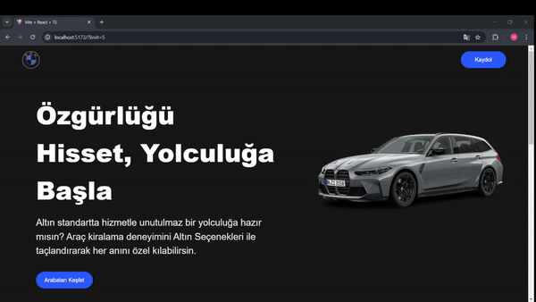

<h1>CAR-RENTAL-WEB</h1> 

This project is a car rental website where users can search for vehicles by brand, model, year, and more. Users can view detailed information about the cars, including features and rental pricing.
 

<h2>Features</h2> 

<ul> 

  <li>Developed using the React library for building interactive user interfaces.</li> 
  <li>Developed using TypeScript for improved type safety and maintainability.</li>
  <li>Styled using Tailwind CSS for a modern and responsive design.</li> 
  <li>Pagination implemented with React Router DOM for seamless navigation.</li> 
  <li>Component testing ensures reliability and functionality of core features.</li> 
  <li>Responsive design, ensuring compatibility with various devices and screen sizes.</li>
  <li>Animations created using Framer Motion for enhanced user experience and interactivity.</li>
  <li>Advanced search functionality allowing users to filter cars by model, brand, year, and other criteria.</li> 
  <li>Detailed car information, including features and rental pricing.</li> 

</ul> 
  
<h2>Screen Gif</h2>

